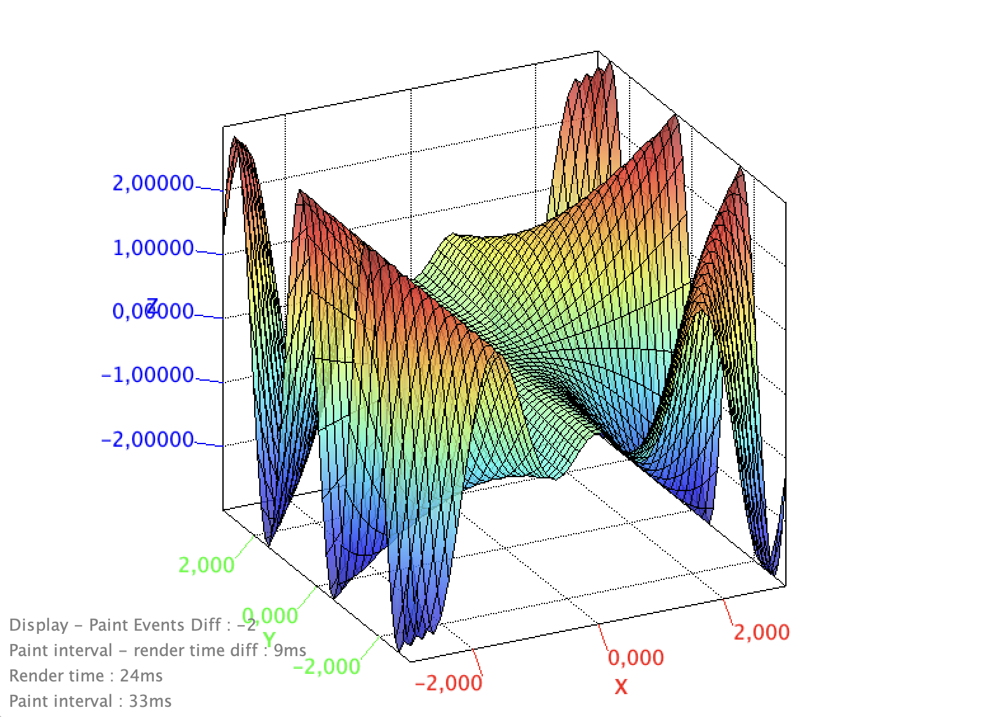
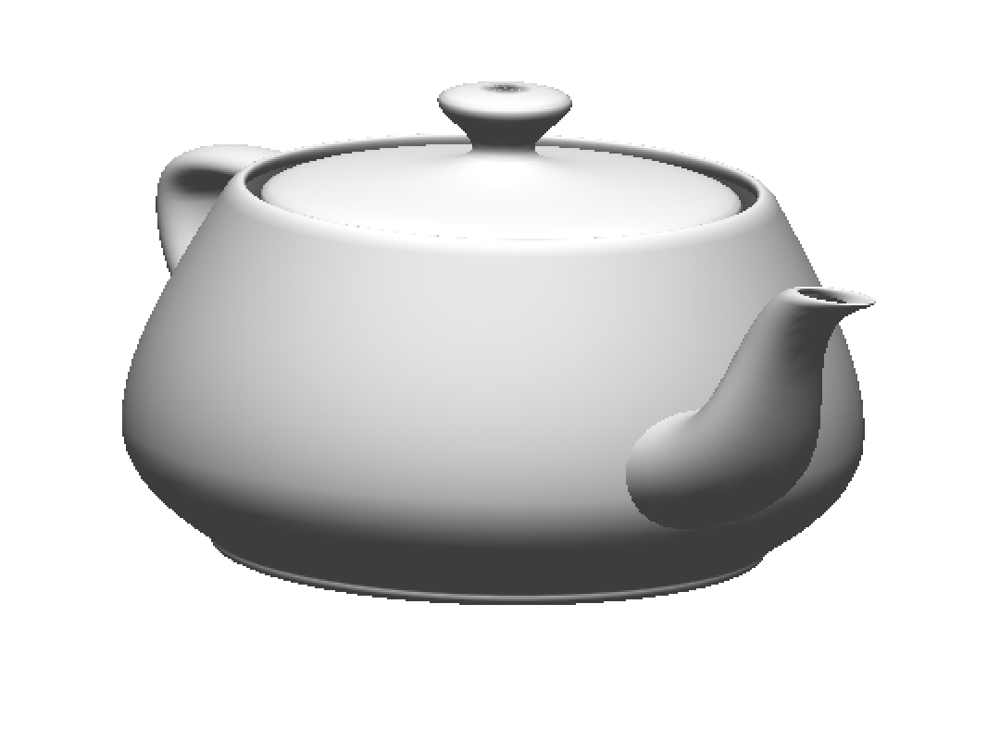

# panama-gl

PanamaGL aims at providing multiplatorm binding to OpenGL using the Foreign Function & Memory API for JDK19.

We here show how to use PanamaGL to run OpenGL based rendering application both as a standalone library AND embedded in the Java 3D Charts framework [Jzy3D](https://github.com/jzy3d/jzy3d-api), which already uses JOGL for GPU rendering and EmulGL for CPU rendering.

## Documentation

### Setup your computer
* [Setup base for everyone](doc/setup/setup_everyone.md)
* [Setup on Linux](doc/setup/setup_ubuntu.md)
* [Setup on macOS](doc/setup/setup_macos.md)
* [Setup on Windows](doc/setup/setup_windows.md)

### Help on technologies used in this project
* [Panama Foreign Help](doc/Panama-Foreign-help.md)
* [OpenGL Help](doc/OpenGL-help.md)
* [Modules Quickstart](https://openjdk.java.net/projects/jigsaw/quick-start)
* [Modules Cheatsheet](https://github.com/tfesenko/Java-Modules-JPMS-CheatSheet)

### Design of Panama GL
* [PanamaGL Design](doc/PanamaGL-Design.md)

## Demos

You can find demos in these projects
* [panama-gl-samples](panama-gl-samples) PanamaGL Swing & AWT Samples
* [panama-gl-jzy3d](panama-gl-jzy3d) Benchmarks
  * Jzy3D Native samples (direct draw to an OS window)
  * Jzy3D Embedded samples (indirect draw to a Java window)
* [panama-gl-wrappers-macos](panama-gl-wrappers-macos) Unit tests in src/test/java 

### 3D offscreen GL demo

* `TestFBO_macOS` and `DemoFBO_Offscreen_macOS`

More details in [demo index](doc/PanamaGL-Demos.md)

### 3D onscreen GL demos

These two demo open a *native* window with Jzy3D (hence not a Java window yet). One can use the mouse to rotate the object, and double click to start an automatic rotation.

| `SurfaceDemoPanamaGL`| `TeapotDemoPanamaGL`|
|-|-|
|  |  |

More details in [demo index](doc/PanamaGL-Demos.md)

## Panama GL Design

The design of the library is defined [here](doc/PanamaGL-Design.md) but roughly described in the schema below.

## OpenGL Wrappers, Bindings, Natives

Let's clarify 3 words
* _Natives_ : native OpenGL libraries (`opengl.dll`, `libGL.dylib`, `libGL.so` with related `GL.h`). Up to now assumed to be available on developer computer.
* _Bindings_ : raw Java classes generated by `JExtract` to invoke _Native_ libraries. Precompiled, available on Maven, Stored [here](https://gitlab.com/jzy3d/panama-gl-bindings).
* _Wrappers_ : thin Java abstraction to fit a common GL interface defined by `panama-gl-core/GL`, wrapping _Bindings_.

This project only provides _Wrappers_ and depends on _Bindings_. This avoid the main projects to recompile large _Bindings_ file source folder and makes IDEs faster.

### Existing Wrappers & Bindings

| Binding | Platform | GPU | Branch |
| ------- | -------- | --- | ------ |
| Linux | Ubuntu 20 | Intel | in progress / Blocked by FBO on Ubuntu |
| Apple | macOS 10.15.7 | Intel | OK |
| Apple | macOS 11.4.0 M1 | M1 | in progress / Blocked by no Panama JDK on ARM yet (Oracle) |
| Microsoft | Windows 10 | Intel | in progress / Blocked by JDK19 |

### Building OpenGL bindings for your platform

To generate new bindings for your platform, see [the setup documentation of the bindings project](https://gitlab.com/jzy3d/panama-gl-bindings/-/tree/main/doc/setup)

* You _should_ only have to do this if you use a computer OS and version for which binding exist already.
* You _may not_ have to regenerate bindings for your OS if its version is supported by existing OS bindings at other versions

# License

All PanamaGL modules as well as JExtractGL are licensed under the [GPLv3 license](https://choosealicense.com/licenses/gpl-3.0/)

# Authors

* Martin Pernollet
