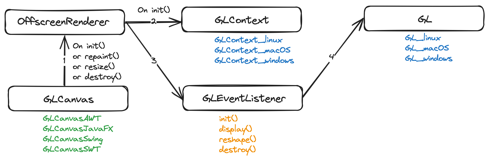
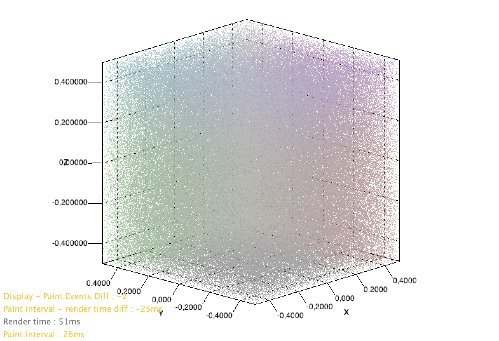
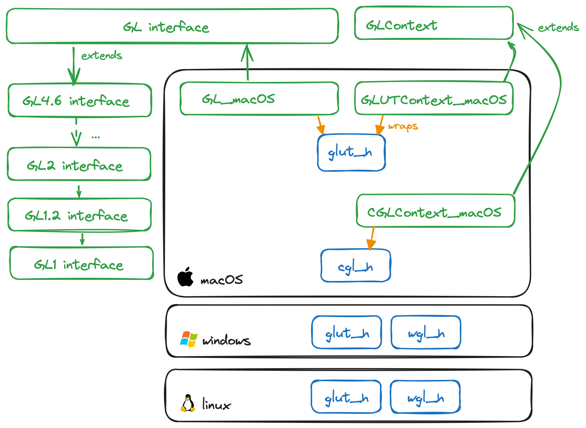
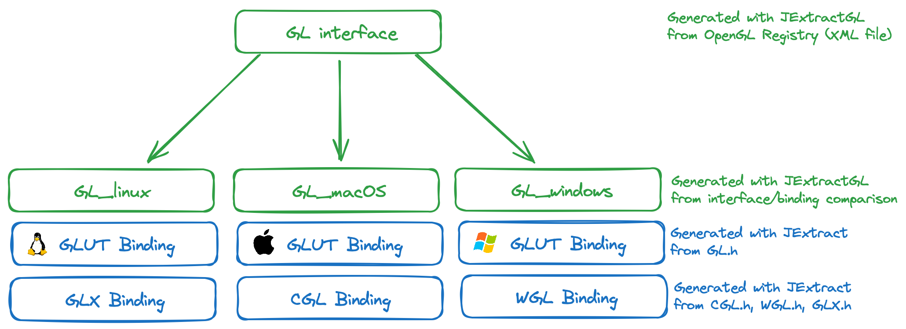

# PanamaGL

PanamaGL is a Java library allowing real time 2D & 3D Graphics everywhere!

Supported :
- Windowing toolkits : `AWT`, `JavaFX`, `Swing` and `SWT`.
- OS : `linux`, `macOS`, `Windows`
- JDK Versions : `22`

The library is based on multi-platform bindings to the `OpenGL` native library and other per-os companion libraries (`CGL` for macOS, `GLX` for Linux and `WGL` for Windows). Most of the code is generated with JExtract.


## Why ?

PanamaGL is similar to JOGL and LWJGL and born many years latter.

PanamaGL is great because it is only made of Java code hence easy to improve and rebuild for any Java developer.

Historical OpenGL bindings like JOGL and LWJGL require generating C code to create native bindings. This makes rebuilding the framework for a large number of target platform difficult since one requires hardware nodes in the CI having all the OS,CPU,GPU (and JDK versions) of the target audience.

PanamaGL bindings use The Foreign Function Memory API introduced in JDK 22, allowing to bind to native library through Java code only. JExtract allows generating the java libraries enabling to invoke OpenGL each OS it was generated on.

With the help of `JExtractGL` we bundle all per target binding under a single `GL` entry point interface.

## How to use

### Skeleton of a PanamaGL application

#### GLEventListener

A rendering application must define when and what should be rendered through a class implementing the four `init()`, `display()`, `reshape()` and `destroy()` hooks of a `GLEventListener`.

```java
public class DrawingListener implements GLEventListener{
  public void init(GL gl) {
    gl.glClearColor(1f, 1f, 1f, 1f);
  }

  public void display(GL gl) {
    gl.glBegin(GL.GL_POINT);
    gl.glColor3f(0.2f, 0.2f, 1f);
    gl.glVertex3f(0.2f, 0.2f, 1f);
    gl.glEnd();
  }

  public void reshape(GL gl, int x, int y, int width, int height) {
    gl.glViewport(x, y, width, height);
  }

  public void destroy(GL gl) {}
}
```

The listener will be invoked by the `AWT thread`.

:warning: OpenGL being single threaded, a `GLEventListener` should never try delegating tasks to other threads otherwise OpenGL errors will occur.

#### GLCanvas

The application must then instantiate a `GLCanvas` according to the UI framework it is based on. It requires a factory that (described later) and must register the `GLEventListener` that will be executed upon init, render or resize of the canvas.

```java
GLCanvas canvas = new GLCanvasSwing(factory);
canvas.setGLEventListener(listener);
```

Available canvases :
* `GLCanvasAWT`
* `GLCanvasJavaFX`
* `GLCanvasSwing`


#### PanamaGLFactory

All per-platform components required to perform drawing are provided by a factory. The `PanamaGLFactory` that is considered compliant with the computer running the program will be elected after the bellow call :

```java
PanamaGLFactory factory = PanamaGLFactory.select();
```

Which returns one of
* `PanamaGLFactory_linux`
* `PanamaGLFactory_macOS`
* `PanamaGLFactory_windows`

Once the canvas gets added to a component hierarchy, a couple of classes will be initialized by the `PanamaGLFactory`.

* The `GLContext` will provide description of the GPU capabilities (supported OpenGL version, etc). The context is made available through the `GLCanvas` once it has initialized offscreen rendering.
* The `OffscreenRenderer` will schedule rendering in the appropriate thread and generate images to be displayed by the `GLCanvas`. It uses an OS-dependent implementation of a `FBO` (a.k.a "Frame Buffer Object") to initialize and use the GPU buffers. All these objects are initialized and used in PanamaGL's `GLCanvas` internally.
* The `GL` instance will allow invoking drawing instructions. It is provided as an input argument of the `GLEventListener` that you implement. One perform drawing instructions with `gl.glDoSomething(args)`





### Going through an example

This is one of the examples available in the [`panama-gl-samples`](panama-gl-samples) maven module in this project.

#### A simple Java Window to render OpenGL

[DemoTeapot_Onscreen_Swing](panama-gl-samples/src/main/java/demos/panamagl/swing/DemoTeapot_Onscreen_Swing.java) application uses the `PanamaGLDemoListener` defined later to draw a teapot in a Java Swing Frame.

:warning: Do not forget to run the program with VM arguments providing the path to the OpenGL binaries as shown in the sample javadoc, e.g. on macOS : ```java PanamaGL_Demo --enable-native-access=ALL-UNNAMED -Djava.library.path=.:/System/Library/Frameworks/OpenGL.framework/Versions/Current/Libraries/```


```java
/**
 * VM arguments to add :
 *
 * for all : --enable-native-access=ALL-UNNAMED
 * macos   : -Djava.library.path=.:/System/Library/Frameworks/OpenGL.framework/Versions/Current/Libraries/
 * linux   : -Djava.library.path=.:/usr/lib/x86_64-linux-gnu/
 * windows : -Djava.library.path="C:\Windows\system32;.\freeglut-MSVC-3.0.0-2.mp\freeglut\bin\x64"
 */
public class PanamaGL_Demo {

  public static void main(String[] args) throws Exception {

    // The Open GL code to render a scene
    GLEventAdapter listener = PanamaGLDemoListener();

    // Detect the current platform and required classes
    PanamaGLFactory factory = PanamaGLFactory.select();

    // Create a canvas to render into
    GLCanvasSwing canvas = new GLCanvasSwing(factory);

    // Link the panel to the scene we want to render
    canvas.setGLEventListener(listener);

    // Create frame to add the panel
    final JFrame frame = new JFrame(DemoTeapot_Onscreen_Swing.class.getSimpleName());
    frame.getContentPane().setLayout(new BorderLayout());
    frame.setBounds(0, 0, 800, 600);
    frame.setDefaultCloseOperation(JFrame.EXIT_ON_CLOSE);

    // Add the OpenGL panel to the frame
    Runnable show = new Runnable() {
      @Override
      public void run() {
        frame.add(canvas, BorderLayout.CENTER);
        frame.setVisible(true);
        frame.setBounds(0, 0, 800, 700);
      }
    };

    // Use this to avoid Swing hangs
    SwingUtilities.invokeLater(show);

    // Start animating the OpenGL scene
    Animator a = new Animator(canvas);
    a.start();
  }
}

```


#### A simple OpenGL scene

The below demonstrates how to extend a `GLEventAdapter` to to invoke drawing instruction when your `GLCanvas` requires so.

```java
/**
 * OpenGL code to render a teapot.
 */
public static GLEventAdapter PanamaGLDemoListener() {
  return new GLEventAdapter() {

    /** When GL Canvas init. */
    @Override
    public void init(GL gl) {

      Arena arena = Arena.ofConfined();

      // Reset Background color
      gl.glClearColor(1f, 1f, 1f, 1f);

      // Setup Lighting
      gl.glShadeModel(GL.GL_SMOOTH);

      var pos = arena.allocateFrom(ValueLayout.JAVA_FLOAT, new float[] {0.0f, 15.0f, -15.0f, 0});
      gl.glLightfv(GL.GL_LIGHT0, GL.GL_POSITION, pos);

      var spec = arena.allocateFrom(ValueLayout.JAVA_FLOAT, new float[] {1, 1, 1, 0});
      gl.glLightfv(GL.GL_LIGHT0, GL.GL_AMBIENT, spec);
      gl.glLightfv(GL.GL_LIGHT0, GL.GL_DIFFUSE, spec);
      gl.glLightfv(GL.GL_LIGHT0, GL.GL_SPECULAR, spec);

      var shini = arena.allocateFrom(ValueLayout.JAVA_FLOAT, 113);
      gl.glMaterialfv(GL.GL_FRONT, GL.GL_SHININESS, shini);
      gl.glEnable(GL.GL_LIGHTING);
      gl.glEnable(GL.GL_LIGHT0);
      gl.glEnable(GL.GL_DEPTH_TEST);

      // Throw runtime exceptions if an OpenGL occured
      GLError.checkAndThrow(gl);
    }

    /** When GL Canvas displays. */
    @Override
    public void display(GL gl) {

      // Reset Background
      gl.glClearColor(1f, 1f, 1f, 1f);
      gl.glClear(GL.GL_COLOR_BUFFER_BIT | GL.GL_DEPTH_BUFFER_BIT);

      // Reset model matrix state
      gl.glPushMatrix();
      gl.glRotatef(-20f, 1f, 1f, 0f);
      gl.glRotatef(rot, 0f, 1f, 0f);

      // Draws a colored teapot
      gl.glColor3f(0.2f, 0.2f, 1f);
      gl.glutSolidTeapot(0.5d);

      // Restore model matrix state
      gl.glPopMatrix();

      // Rotate
      rot += 0.45;

      // Throw runtime exceptions if an OpenGL occured
      GLError.checkAndThrow(gl);
    }

    /** When GL Canvas resizes. */
    @Override
    public void reshape(GL gl, int x, int y, int width, int height) {

      // Resize OpenGL viewport
      gl.glViewport(x, y, width, height);
    }

    protected float rot = 0;

  };
}
```

This example will show a rotating teapot :


### Dependencies

One of the following Maven dependencies should be added to your project according to the UI framework of your application :

#### Supported toolkits

##### AWT dependency


```xml
<dependency>
  <groupId>org.jzy3d</groupId>
  <artifactId>panama-gl-ui-awt</artifactId>
  <version>1.2.0-SNAPSHOT</version>
</dependency>
```
##### JavaFX dependency

```xml
<dependency>
  <groupId>org.jzy3d</groupId>
  <artifactId>panama-gl-ui-javafx</artifactId>
  <version>1.2.0-SNAPSHOT</version>
</dependency>
```

##### Swing dependency
```xml
<dependency>
  <groupId>org.jzy3d</groupId>
  <artifactId>panama-gl-ui-swing</artifactId>
  <version>1.2.0-SNAPSHOT</version>
</dependency>
```

#### Repository

:warning: PanamaGL is not yet available on Maven Central. You must add the following repositories to the list of the Maven repositories of your project `pom` file :

```xml
<repositories>
  <repository>
    <id>jzy3d-snapshots</id>
    <name>Jzy3d Snapshots</name>
    <url>https://maven.jzy3d.org/snapshots/</url>
  </repository>
  <repository>
    <id>jzy3d-releases</id>
    <name>Jzy3d Releases</name>
    <url>https://maven.jzy3d.org/releases/</url>
  </repository>
</repositories>
```

### Demos

You can find demos in these projects
* [panama-gl-samples](panama-gl-samples) PanamaGL Swing & AWT Samples
* [panama-gl-jzy3d](panama-gl-jzy3d) Benchmarks
  * Jzy3D Native samples (direct draw to an OS window)
  * Jzy3D Embedded samples (indirect draw to a Java window)
* [panama-gl-wrappers-macos](panama-gl-wrappers-macos) Unit tests in src/test/java

#### 3D onscreen GL demos

These demos open a Swing or JavaFX Window. One can use the mouse to rotate the object, and double click to start an automatic rotation.

| `SurfaceDemo_PanamaGL`| `DemoTeapot_Onscreen_Swing`|
|-|-|
|  |  |
| `ScatterDemo_PanamaGL`| `DemoTeapot_Onscreen_JavaFX`|
|  |  |

More details in [demo index](doc/PanamaGL-Demos.md)

#### 3D offscreen GL demo

* `TestFBO_macOS` and `DemoFBO_Offscreen_macOS`

More details in [demo index](doc/PanamaGL-Demos.md)


## How to develop

:warning: This section is useful for people willing to enhance and customize PanamaGL.

PanamaGL is made of two repositories
* `panama-gl` : the current repository delivering the API.
* `panama-gl-bindings` : the raw binding code to OpenGL generated by JExtract .

### GL API and implementations

`panama-gl` has its API generated by `JExtractGL`. It is based on a couple of Java interface that extend themselves to show the effect of OpenGL version extensions.

`GL` and `GLContext` have implementation for each target OS that will in turn invoke the java code that was generated for this target. The generated Java code is the one provided by `panama-gl-bindings`.



### Platform independance

Platform independance is enabled by generalizing the above implementation scheme for each required target :



#### OpenGL Wrappers, Bindings, Natives

Let's clarify 3 words
* _Natives_ : native OpenGL libraries (`opengl.dll`, `libGL.dylib`, `libGL.so` with related `GL.h`). Up to now assumed to be available on the developer or user computer.
* _Bindings_ : raw Java classes generated by `JExtract` to invoke _Native_ libraries. Precompiled, available on Maven, Stored [here](https://gitlab.com/jzy3d/panama-gl-bindings).
* _Wrappers_ : thin Java abstraction to fit a common GL interface defined by `panama-gl-core/GL`, wrapping _Bindings_.

This project only provides _Wrappers_ and depends on _Bindings_. This avoid the main projects to recompile large _Bindings_ file source folder and makes IDEs faster.


### Build, test, deploy

Any computer able to build Java code with Maven can rebuild the complete API :

```
mvn install
```

This assumes the [bindings artifacts](https://gitlab.com/jzy3d/panama-gl-bindings/) (`panama-gl-bindings`) are used as is from our Maven repository but you can override them locally by building your own customization of the bindings libs.

#### Tests

Tests are made of
* `Test*_all` Generic Unit Tests
* `Test*_Platform` Platform specific Unit Tests (`Test*_macOS`, `Test*_linux`, etc)
* `DurabilityTest*` Stress Tests

All computers run all unit tests, but platform specific tests (`Test*_macOS`) will only execute on the suggested target. If they do not execute they issue a console warning during the Maven test phase. Modifying a generic class may mean to review all `Test*_Platform` tests.

Minor release should
- run unit tests on all target platforms {CPU, OS, JDK}.


Major release should
- run unit tests on all target platforms {CPU, OS, JDK}.
- run additional `DurabilityTest*` manually.
The computer building the test only runs test for its platform. Properly validating an API improvement hence requires running the tests, especially integration tests such as `DurabilityTest` manually.

To build _without_ running the tests :

```
mvn install -DskipTests
```

To deploy to Maven repository :

```
mvn deploy
```


### Generate new code

#### Generate new bindings

To generate new bindings for your platform, see [the setup documentation of the bindings project](https://gitlab.com/jzy3d/panama-gl-bindings/-/tree/main/doc/setup)

* You _should_ only have to do this if you use a computer OS and version for which bindings do NOT exist already.
* You _may not_ have to regenerate bindings for your OS if its version is supported by existing OS bindings at other versions

#### Generate new wrappers

...


## Documentation

PanamaGL aims at providing multiplatorm bindings to OpenGL using the Foreign Function & Memory API for JDK22 and later.

### Setup your computer
* [Setup base for everyone](doc/setup/setup_everyone.md)
* [Setup on Linux](doc/setup/setup_ubuntu.md)
* [Setup on macOS](doc/setup/setup_macos.md)
* [Setup on Windows](doc/setup/setup_windows.md)

### Help on technologies used in this project
* [Panama Foreign Help](doc/Panama-Foreign-help.md)
* [OpenGL Help](doc/OpenGL-help.md)
* [Modules Quickstart](https://openjdk.java.net/projects/jigsaw/quick-start)
* [Modules Cheatsheet](https://github.com/tfesenko/Java-Modules-JPMS-CheatSheet)

### Design of Panama GL
* [PanamaGL Design](doc/PanamaGL-Design.md)

# License

All PanamaGL modules as well as JExtractGL are licensed under the [GPLv3 license](https://choosealicense.com/licenses/gpl-3.0/)

# Authors

* Martin Pernollet
