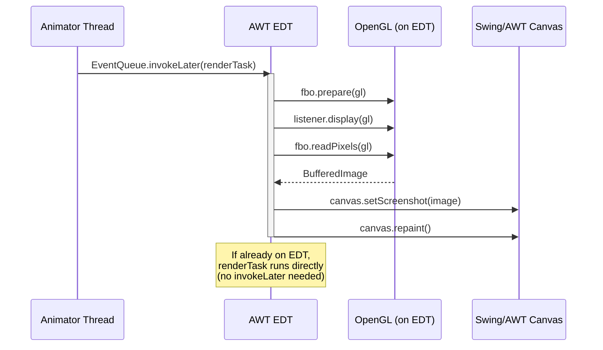
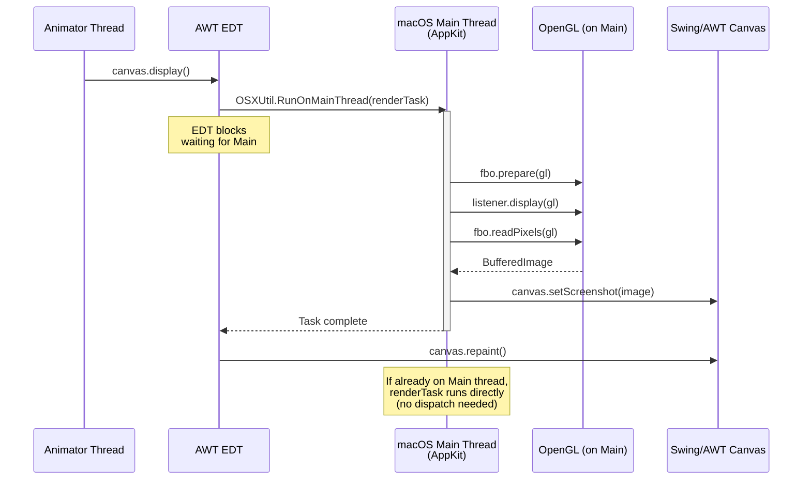
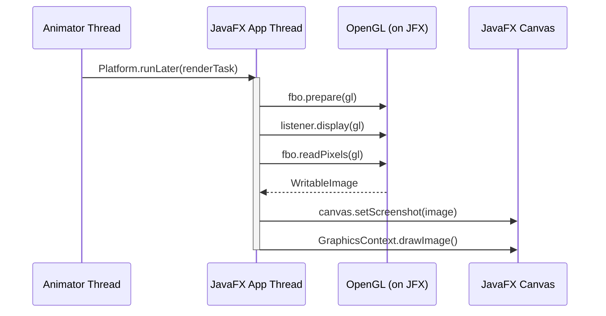

# Multithreading and OpenGL in PanamaGL

## OpenGL is single-threaded

OpenGL is fundamentally a single-threaded API. An OpenGL context can only be **current** on one thread at a time, and all GL calls must be issued from the thread that owns the current context. Calling GL functions from a thread that does not own the context leads to undefined behavior, silent failures, or crashes.

This means that in a Java application — where multiple threads coexist (main thread, AWT Event Dispatch Thread, JavaFX Application Thread, animator threads, etc.) — we must carefully route all OpenGL calls to a single, consistent thread.

PanamaGL solves this through the `ThreadRedirect` abstraction: each GL operation is wrapped in a `Runnable` and dispatched to the appropriate thread depending on the OS and windowing toolkit.

---

## Startup requirements

The table below summarizes whether `-XstartOnFirstThread` is required for each combination of windowing toolkit and OS.

| Toolkit | Windows | Linux | macOS (CGL) | macOS (GLUT) |
|---------|---------|-------|-------------|--------------|
| **AWT** | No flag needed | No flag needed | No flag needed | `-XstartOnFirstThread` required |
| **Swing** | No flag needed | No flag needed | No flag needed | `-XstartOnFirstThread` required |
| **JavaFX** | No flag needed | No flag needed | **Must NOT use** `-XstartOnFirstThread` | **Must NOT use** `-XstartOnFirstThread`¹ |
| **SWT** | No flag needed | No flag needed | TBD | TBD |

¹ JavaFX manages its own main thread via `Platform.startup()`. Using `-XstartOnFirstThread` conflicts with this and causes a freeze. This means JavaFX + GLUT on macOS is currently not supported (GLUT requires `-XstartOnFirstThread` but JavaFX forbids it).

### Notes

- **macOS with CGL**: CGL is a low-level API whose contexts are thread-portable. There is no requirement to run on the macOS main thread, so `-XstartOnFirstThread` is **not** required. GL calls are routed to the AWT EDT or JavaFX Application Thread depending on the toolkit.
- **macOS with GLUT**: GLUT requires the macOS main thread for its event loop (`glutMainLoop`) and window management. `-XstartOnFirstThread` is required so that the Java main thread is the AppKit main thread. Without it, `OSXUtil.RunOnMainThread()` is used, but this can deadlock if the main thread is not pumping AppKit events.
- **JavaFX on macOS**: `-XstartOnFirstThread` must **not** be used. JavaFX manages its own main thread (the JavaFX Application Thread) via `Platform.startup()`. Adding `-XstartOnFirstThread` causes the Java main thread to become the AppKit main thread, which conflicts with JavaFX's own thread initialization and causes a freeze. The `panama-gl-ui-javafx` module overrides the parent surefire configuration to exclude this flag.
- **Windows and Linux**: No special JVM flags are needed. The AWT Event Dispatch Thread or JavaFX Application Thread is used for GL calls.
- **SWT**: Work in progress (branch `ui/swt`). SWT has its own event loop and threading model that will need a dedicated `ThreadRedirect_SWT` implementation. On macOS, SWT typically requires the main thread, so `-XstartOnFirstThread` will likely be needed.

---

## Implementation: ThreadRedirect strategy per platform

The table below shows which `ThreadRedirect` implementation is used for each combination of toolkit, OS, and GL binding.

| Toolkit | Windows (WGL) | Windows (GLUT) | Linux (GLX) | Linux (GLUT) | macOS (CGL) | macOS (GLUT) |
|---------|--------------|----------------|-------------|--------------|-------------|--------------|
| **AWT** | `AWTThreadRedirect` | `AWTThreadRedirect` | `AWTThreadRedirect` | `AWTThreadRedirect` | `AWTThreadRedirect` | `MacOSThreadRedirect` |
| **Swing** | `AWTThreadRedirect` | `AWTThreadRedirect` | `AWTThreadRedirect` | `AWTThreadRedirect` | `AWTThreadRedirect` | `MacOSThreadRedirect` |
| **JavaFX** | `ThreadRedirect_JFX` | `ThreadRedirect_JFX` | `ThreadRedirect_JFX` | `ThreadRedirect_JFX` | `ThreadRedirect_JFX` | `MacOSThreadRedirect`¹ |
| **SWT** | TBD | TBD | TBD | TBD | TBD | TBD |
| **None (offscreen only)** | `NoRedirect` | `NoRedirect` | `NoRedirect` | `NoRedirect` | `NoRedirect`² | `MacOSThreadRedirect` |

¹ JavaFX on macOS with GLUT may require `MacOSThreadRedirect` instead of `ThreadRedirect_JFX`, since GLUT requires the main thread. This needs further testing.

² When running purely offscreen with CGL (no UI toolkit), `NoRedirect` can be used if the caller ensures all GL calls come from the same thread.

### Key differences between CGL and GLUT on macOS

| Aspect | CGL | GLUT |
|--------|-----|------|
| Thread requirement | Any thread (thread-portable) | macOS main thread only |
| `-XstartOnFirstThread` | Not required | Required |
| ThreadRedirect | `AWTThreadRedirect` or `ThreadRedirect_JFX` | `MacOSThreadRedirect` |
| OpenGL profile | Configurable (Legacy 2.1 or Core 4.1) | Legacy 2.1 (default) |
| Deadlock risk | Low | High if main thread not in event loop |

### Key differences between WGL and GLUT on Windows

| Aspect | WGL | GLUT |
|--------|-----|------|
| Thread requirement | Any thread (context must be current) | Any thread |
| ThreadRedirect | `AWTThreadRedirect` | `AWTThreadRedirect` |

### Key differences between GLX and GLUT on Linux

| Aspect | GLX | GLUT |
|--------|-----|------|
| Thread requirement | Any thread (context must be current) | Any thread |
| ThreadRedirect | `AWTThreadRedirect` | `AWTThreadRedirect` |

---

## How each ThreadRedirect works

### AWTThreadRedirect (AWT / Swing)

**Used on:** Windows, Linux, and macOS with CGL.

**Constraint:** AWT and Swing are single-threaded UI toolkits. All UI updates must happen on the Event Dispatch Thread (EDT). Since PanamaGL performs offscreen rendering and then paints the result onto a Swing/AWT component, the GL operations and the subsequent `repaint()` call must be coordinated with the EDT.

**Behavior:**
- If the calling thread is already the EDT → execute the `Runnable` directly.
- If the calling thread is not the EDT → post the `Runnable` via `EventQueue.invokeLater()`.

**Why it works for CGL on macOS:** CGL contexts are thread-portable — they can be made current on any thread. Since all GL calls are consistently routed to the EDT, the context stays current on that thread. No macOS main thread involvement is needed.



### MacOSThreadRedirect (macOS with GLUT)

**Used on:** macOS when GLUT is the GL binding.

**Constraint:** GLUT on macOS requires all GLUT calls (including window creation, display callbacks, and event handling) to happen on the **macOS main thread** (the AppKit thread). This is a macOS platform requirement for any code that interacts with the AppKit framework.

**Behavior:**
- If the calling thread is already the main thread (detected via `OSXUtil.IsMainThread()`) → execute the `Runnable` directly. This avoids deadlocks when using `-XstartOnFirstThread`.
- If the calling thread is not the main thread → post the `Runnable` via `OSXUtil.RunOnMainThread(false, true, runnable)`, which dispatches to the AppKit run loop and blocks until completion.

**Deadlock risk:** If the main thread is not pumping AppKit events (e.g., `main()` has returned and no run loop is active), `RunOnMainThread` will block forever. This is why `-XstartOnFirstThread` is required for GLUT — it ensures the Java main thread is the AppKit main thread, and JOGL's `GLProfile.initSingleton()` sets up the event loop.



### ThreadRedirect_JFX (JavaFX)

**Used on:** All platforms when JavaFX is the windowing toolkit (with CGL on macOS, or on Windows/Linux).

**Constraint:** JavaFX has its own UI thread called the **JavaFX Application Thread**. All scene graph modifications and rendering must happen on this thread. It is distinct from the AWT EDT — JavaFX and AWT have separate event loops.

**Behavior:**
- Posts the `Runnable` via `Platform.runLater(runnable)`, which queues it on the JavaFX Application Thread.
- Unlike `AWTThreadRedirect`, there is currently no check for "already on the JavaFX thread" — the task is always posted via `runLater()`.

**Note:** On macOS with GLUT and JavaFX, the `MacOSThreadRedirect` may need to take precedence over `ThreadRedirect_JFX`, since GLUT requires the main thread regardless of the UI toolkit. This combination needs further testing.



### NoRedirect

**Used for:** Offscreen-only rendering where the caller controls the thread.

**Behavior:** Executes the `Runnable` immediately on the calling thread. No thread switching occurs.

**When to use:** When there is no UI toolkit involved and the application ensures all GL calls originate from the same thread. Useful for headless rendering, tests, or batch processing.

---

## Architecture overview

The `ThreadRedirect` is injected into the `OffscreenRenderer` at two levels:

1. **Factory level** (`APanamaGLFactory.setThreadRedirect()`): Sets a global override. If set, it is passed to any `OffscreenRenderer` created by the factory.
2. **Renderer level** (`OffscreenRenderer.setThreadRedirect()`): Set by platform-specific factories or canvas constructors.

The priority is:
1. Factory-level `ThreadRedirect` (if explicitly set by the user)
2. Canvas-level override (e.g., `GLCanvasJFX` sets `ThreadRedirect_JFX`)
3. Platform default (e.g., `OffscreenRenderer_macOS` defaults to `MacOSThreadRedirect`, others default to `AWTThreadRedirect`)

```
User code
  │
  ▼
GLCanvas.display()
  │
  ▼
OffscreenRenderer.onDisplay()
  │
  ▼
ThreadRedirect.run(renderTask)    ◄── Dispatches to the correct thread
  │
  ├── AWTThreadRedirect       → AWT Event Dispatch Thread
  ├── MacOSThreadRedirect     → macOS Main Thread (AppKit)
  ├── ThreadRedirect_JFX      → JavaFX Application Thread
  ├── NoRedirect              → Current thread (no switch)
  └── ThreadRedirect_SWT      → SWT UI Thread (TBD)
  │
  ▼
OpenGL calls (context must be current on this thread)
  │
  ▼
canvas.repaint()  → back to UI thread for display
```
